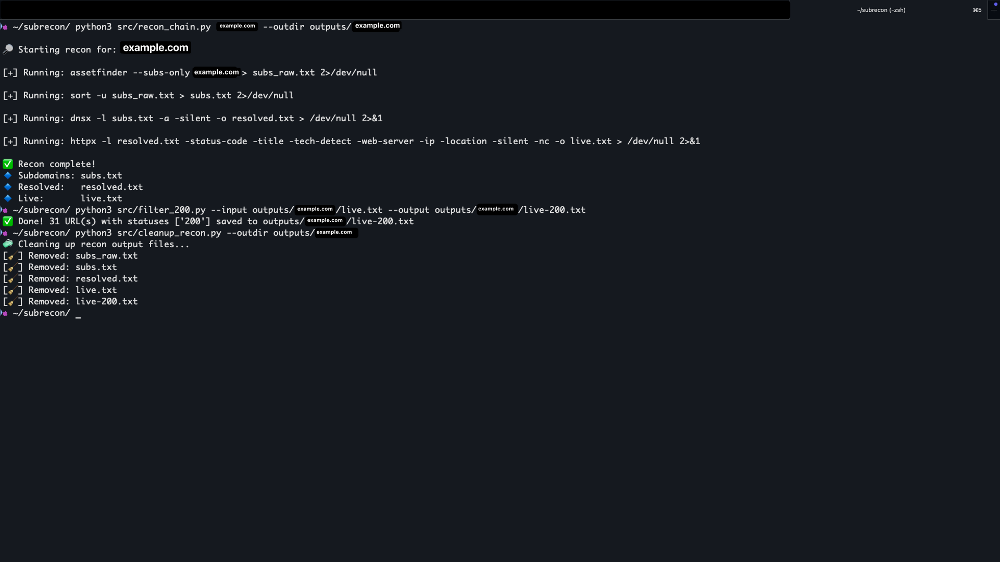

# subrecon
```
             __
   ___ __ __/ /  _______ _______  ___
  (_-</ // / _ \/ __/ -_) __/ _ \/ _ \
 /___/\_,_/_.__/_/  \__/\__/\___/_//_/
        t3lesph0re
```

**Author:** [@t3lesph0re](https://github.com/t3lesph0re)

## What is subrecon?

subrecon is a command-line tool that automates subdomain reconnaissance. It chains together industry-standard tools into a single command that takes a target domain and returns only the live, reachable web servers — filtering out the noise.

Given a domain, subrecon will:

1. **Enumerate** subdomains from multiple sources (assetfinder + subfinder)
2. **Resolve** them via DNS to confirm they exist (dnsx)
3. **Probe** each one for a live web server (httpx)
4. **Filter** the results down to only HTTP 200 responses

One command in. Clean list of live targets out.
```
subrecon example.com

[*] Target: example.com

[1/3] Enumerating subdomains...
      22253 unique → subs.txt
[2/3] Resolving DNS...
      9 resolved → resolved.txt
[3/3] Probing for live hosts...
      3 live → live.txt
[4/4] Filtered [200] → 3 URL(s) → live-200.txt

[✓] Results in outputs/example.com/
```

## Install

### 1. Install subrecon
```bash
git clone https://github.com/t3lesph0re/subrecon.git
cd subrecon
```

**macOS / Linux:**
```bash
pipx install .
# or
pip install .
```

**Windows (PowerShell):**
```powershell
pip install .
```

After install, `subrecon` is available as a command from anywhere.

### 2. Install required CLI tools

subrecon wraps these tools — they must be installed and in your `$PATH`:

| Tool | Purpose | Required? |
|------|---------|-----------|
| [assetfinder](https://github.com/tomnomnom/assetfinder) | subdomain enumeration | Yes |
| [dnsx](https://github.com/projectdiscovery/dnsx) | DNS resolution | Yes |
| [httpx](https://github.com/projectdiscovery/httpx) | web probing | Yes |
| [subfinder](https://github.com/projectdiscovery/subfinder) | additional enum sources | No (recommended) |

**macOS (Homebrew):**
```bash
brew install assetfinder
brew install projectdiscovery/tap/dnsx
brew install projectdiscovery/tap/httpx
brew install projectdiscovery/tap/subfinder
```

**Linux (Go):**
```bash
go install github.com/tomnomnom/assetfinder@latest
go install github.com/projectdiscovery/dnsx/cmd/dnsx@latest
go install github.com/projectdiscovery/httpx/cmd/httpx@latest
go install github.com/projectdiscovery/subfinder/v2/cmd/subfinder@latest
```

**Windows (Go):**
```powershell
go install github.com/tomnomnom/assetfinder@latest
go install github.com/projectdiscovery/dnsx/cmd/dnsx@latest
go install github.com/projectdiscovery/httpx/cmd/httpx@latest
go install github.com/projectdiscovery/subfinder/v2/cmd/subfinder@latest
```

Make sure your Go bin directory is in your PATH. On Windows this is typically `%USERPROFILE%\go\bin`.

## Usage
```bash
# Basic — all defaults
subrecon example.com

# Verbose — see tool output as it runs
subrecon example.com -v

# Custom output directory
subrecon example.com -o ~/recon/target

# Keep multiple status codes (not just 200)
subrecon example.com -s 200,301,302

# Skip the filter step entirely
subrecon example.com --no-filter

# Clean up output files
subrecon clean outputs/example.com
```

## How it works

| Step | Tool | Output |
|------|------|--------|
| 1. Enumerate | assetfinder + subfinder | `subs.txt` |
| 2. Resolve | dnsx | `resolved.txt` |
| 3. Probe | httpx | `live.txt` |
| 4. Filter | built-in | `live-200.txt` |

Results go to `outputs/<domain>/` by default.

## Demo



## Disclaimer

Only test domains you own or have explicit written permission to assess.

## License

[MIT](./LICENSE)